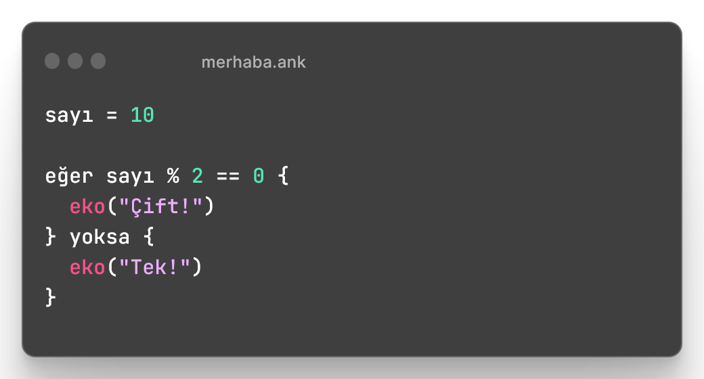
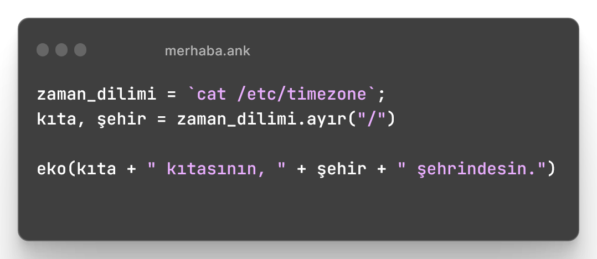

# 👋 Merhaba

Anka, hızlı ve kolay kullanımı ile öne çıkan bir Türkçe yazılım dilidir. Bu dil ile kullanıcılar programları kolayca yazabilir ve uygulamaları hızlı bir şekilde çalıştırabilirler. Anka ayrıca Türkçe komutlar içererek kullanıcılar için daha anlaşılır ve kullanımı kolay bir seçenek sunmaktadır.

Aşağıda Anka ile yazılmış birkaç kod örneğine bakabilirsin. Merak etme, bu sitede bu örneklerin hepsinin nasıl çalıştığı da dahil olmak üzere Anka dilini sana tamamı ile anlatacağız.



Anka ile bir selam dünya örneği.

<figure><figcaption></figcaption></figure>



Anka ile bir sayının tek mi yoksa çift mi olduğunu kontrol eden bir örnek

<figure><figcaption></figcaption></figure>



Anka ile windows, linux ve macos da komut kullanmak çok kolay.

<figure><figcaption></figcaption></figure>



