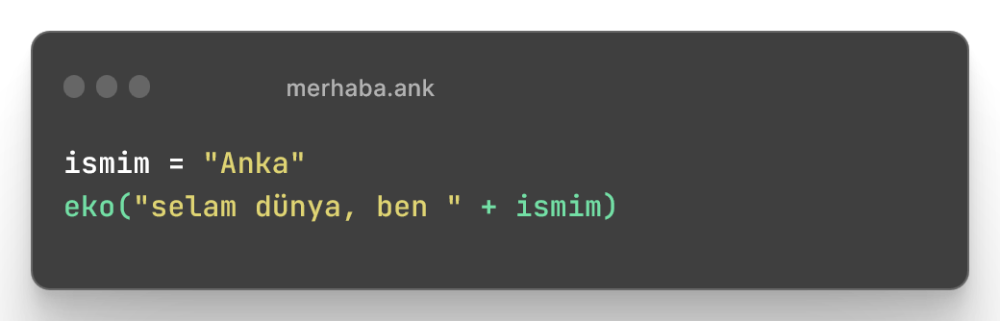

# 👋 Merhaba

Anka, hızlı ve kolay kullanımı ile öne çıkan bir Türkçe yazılım dilidir. Bu dil ile kullanıcılar programları kolayca yazabilir ve uygulamaları hızlı bir şekilde çalıştırabilirler. Anka ayrıca Türkçe komutlar içererek kullanıcılar için daha anlaşılır ve kullanımı kolay bir seçenek sunmaktadır.



Anka ile kod yazmak her zamankinden kolay.

<figure><figcaption></figcaption></figure>



Anka ile bir sayının tek mi yoksa çift mi olduğuna bakalım!

<figure><figcaption></figcaption></figure>



Anka ile windows/linux ve macos da komut kullanmak çok kolay.

<figure><figcaption></figcaption></figure>



